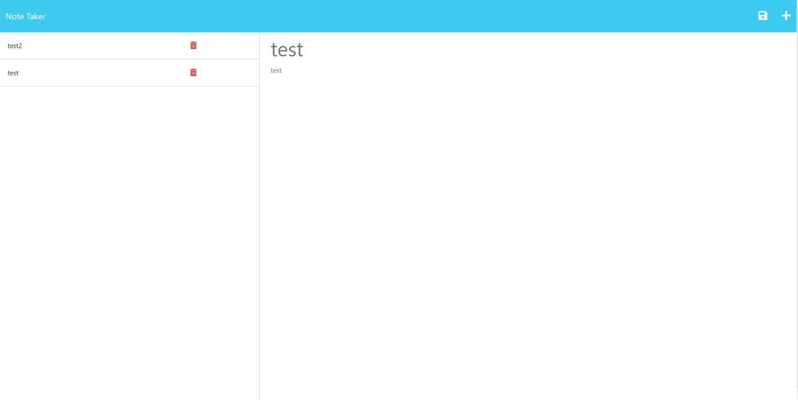
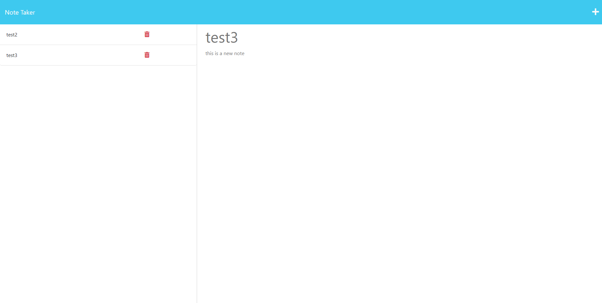

# Note-Taker-Application

Module 11 Challenge

## Description

This application is a Note Taker Application. The user can notes with a title and a body. After typing the note it can be saved, and then the user can click on the note and add to an existing note. If the user needs to they can also delete any note.

## Screenshots

## Link

https://module-11-notetakerapp.herokuapp.com/
